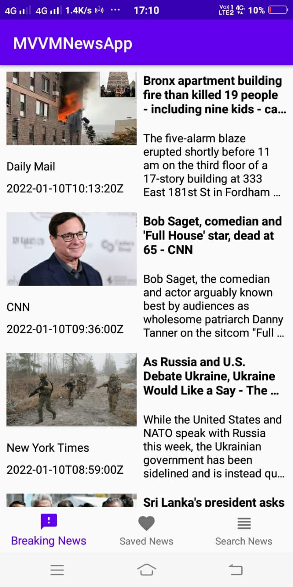
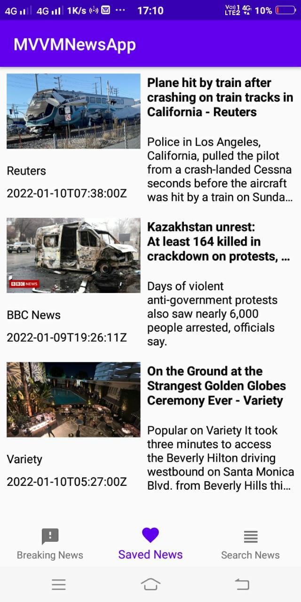
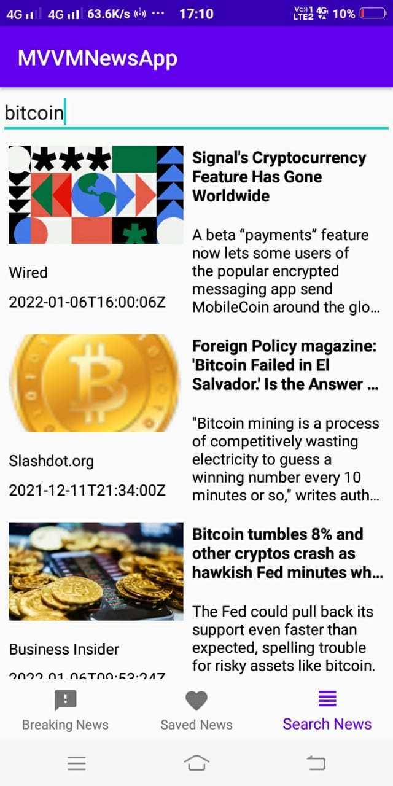

# Insight
## News App for you all to keep you updated.

### Problem Statement:

It is very important to keep ourselves updated. News is important for a number of reasons within a society. Mainly to inform the public about events that are around them and may affect them. 
Often news is for entertainment purposes too; to provide a distraction of information about other places people are unable to get to or have little influence over. News can make people feel connected too. echnology plays a vital role in day-to-day life activities which in turn made great changes in many work fields and out of them Mobile Application is one of the major developments. Mobile Application can be used effectively for this job as they are widely used and are known for easy access.

### Proposed Solution:

This project proposes a "News Application" which displays a list of daily news by making use of News API. Users can read the articles, save them for later references, delete the saved articles and also search articles based on their interest.
The App has a very interactive interface and users who love reading news can have this to keep them up-to date. 

  
  
  
  
  

### Functionality & Concepts used :
- The App has a very simple and interactive interface which helps the users read, save, delete, search articles. Following are few android concepts used to achieve the functionalities in app :
- Android Jetpack Navigation Component : To switch between different fragments namely, breaking news, saved news, search news and article. Using Navigation Component increases app's interface as well as app's user experience.
- LiveData & Room Database : We are also using LiveData to update the news feed and saved articles and also update it to local databases using Room. 
- Glide Library - To display images in the app as fetched by the NEWS API.
- RecyclerView - To display news in a scrollable List.
- Retrofit - To make it easier to consume RESTful web services.

### Application Link & Future Scope :
- You can access the app by clicking here: https://github.com/KOMALDEWNANI/Insight/releases/tag/v1.0.0
- We plan to categorize the news into different sections like educational, current affairs, technology etc.
- Include Authentication feature by using OAuth framework.
- Ask for user's interest and filter news accordingly.

